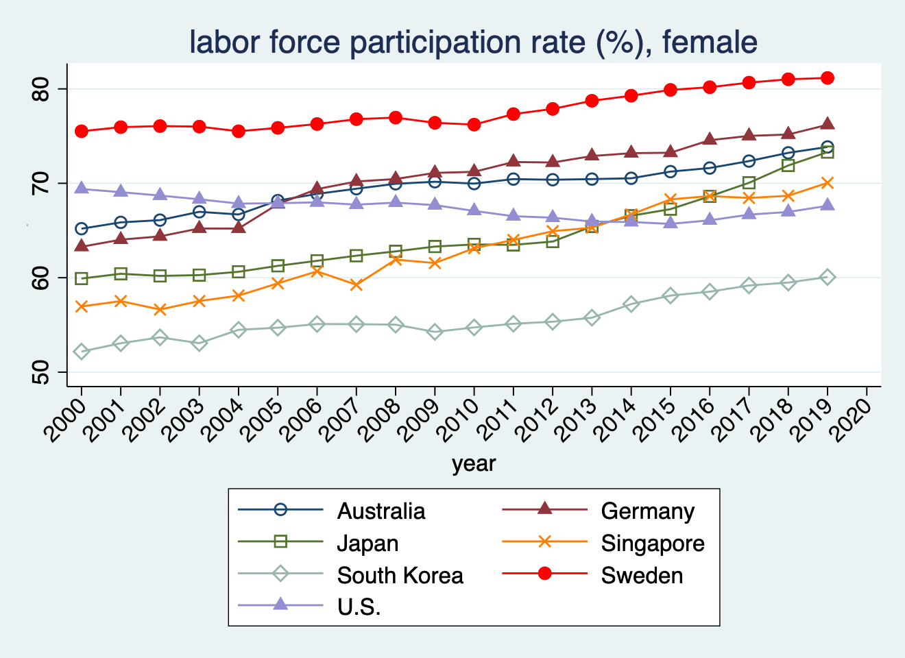

## Introduction

-Objective: Reproduce the graph and table using Rstudio. These figures show “Labor force participation rate%female" and the table shows "the annual household labor income"

-Tools: These figures have been replicated in Rstudio by packages called ggplot2[@wickham2016ggplot2] , dplyr, [@wickham2014], modelsummary, -[@arel-bundock2022], kableExtra,[@zhu2017].

-Result: To understand the female's labor force participation and also the annual household labor income

## Introduction

-We used ggplot2 ,dplyr for replicating the graph and we used modelsummary, dplyr to replicate the table.

-This paper [@choi2025]asks this question that do people with stronger strategic thinking abilities earn more or perform better economically? And does this effect go beyond individuals to benefit households?

-This has been study on 3000 people in South Korea and Singapore.

## Challenges

\_ Old version of Rstudio

\_ Pushing to github

\_ Making a reference list

## Original graph



## Replicated graph

```{r}
if (!require(pacman)) install.packages("pacman")
# Load required packages
library(ggplot2)
library(dplyr)

# Simulated example data (replace with actual dataset if available)
set.seed(123)  # For reproducibility
data <- data.frame(
  year = rep(2000:2020, 7),
  flfp = runif(21 * 7, min = 52, max = 81),
  country = rep(c("Australia", "Germany", "Japan", "Singapore", 
                  "South Korea", "Sweden", "U.S."), each = 21)
)

# Define custom colors for countries
country_colors <- c(
  "Australia"   = "navy",
  "Germany"     = "maroon",
  "Japan"       = "forestgreen",
  "Singapore"   = "orange",
  "South Korea" = "lightgreen",
  "Sweden"      = "red",
  "U.S."        = "purple"  # 'lavender' is hard to see; replaced with darker purple
)

# Define custom shapes for countries
country_shapes <- c(
  "Australia"   = 1,
  "Germany"     = 2,
  "Japan"       = 0,
  "Singapore"   = 4,
  "South Korea" = 5,
  "Sweden"      = 16,
  "U.S."        = 6
)

# Create the plot
ggplot(data, aes(x = year, y = flfp, color = country, shape = country)) +
  geom_line(linewidth = 0.8) +
  geom_point(size = 2) +
  scale_color_manual(values = country_colors) +
  scale_shape_manual(values = country_shapes) +
  scale_x_continuous(breaks = seq(2000, 2020, 2)) +
  labs(
    title = "Female Labor Force Participation Rate (%, 2000–2020)",
    subtitle = "Across Selected Countries",
    x = "Year",
    y = "Participation Rate (%)",
    caption = "Source: Simulated Data"
  ) +
  theme_minimal(base_size = 12) +
  theme(
    axis.text.x = element_text(angle = 45, hjust = 1),
    panel.grid.minor = element_blank(),
    panel.grid.major.y = element_line(color = "gray80", linetype = "solid", linewidth = 0.4),
    legend.position = "bottom",
    legend.box = "horizontal",
    legend.title = element_blank(),
    plot.title = element_text(face = "bold", size = 14),
    plot.subtitle = element_text(size = 11)
  )

```

## Replication code of graph

```{r, eval=FALSE, echo=TRUE}
if (!require(pacman)) install.packages("pacman")
# Load required packages
library(ggplot2)
library(dplyr)

# Simulated example data (replace with actual dataset if available)
set.seed(123)  # For reproducibility
data <- data.frame(
  year = rep(2000:2020, 7),
  flfp = runif(21 * 7, min = 52, max = 81),
  country = rep(c("Australia", "Germany", "Japan", "Singapore", 
                  "South Korea", "Sweden", "U.S."), each = 21)
)

# Define custom colors for countries
country_colors <- c(
  "Australia"   = "navy",
  "Germany"     = "maroon",
  "Japan"       = "forestgreen",
  "Singapore"   = "orange",
  "South Korea" = "lightgreen",
  "Sweden"      = "red",
  "U.S."        = "purple"  # 'lavender' is hard to see; replaced with darker purple
)

# Define custom shapes for countries
country_shapes <- c(
  "Australia"   = 1,
  "Germany"     = 2,
  "Japan"       = 0,
  "Singapore"   = 4,
  "South Korea" = 5,
  "Sweden"      = 16,
  "U.S."        = 6
)

# Create the plot
ggplot(data, aes(x = year, y = flfp, color = country, shape = country)) +
  geom_line(linewidth = 0.8) +
  geom_point(size = 2) +
  scale_color_manual(values = country_colors) +
  scale_shape_manual(values = country_shapes) +
  scale_x_continuous(breaks = seq(2000, 2020, 2)) +
  labs(
    title = "Female Labor Force Participation Rate (%, 2000–2020)",
    subtitle = "Across Selected Countries",
    x = "Year",
    y = "Participation Rate (%)",
    caption = "Source: Simulated Data"
  ) +
  theme_minimal(base_size = 12) +
  theme(
    axis.text.x = element_text(angle = 45, hjust = 1),
    panel.grid.minor = element_blank(),
    panel.grid.major.y = element_line(color = "gray80", linetype = "solid", linewidth = 0.4),
    legend.position = "bottom",
    legend.box = "horizontal",
    legend.title = element_blank(),
    plot.title = element_text(face = "bold", size = 14),
    plot.subtitle = element_text(size = 11)
  )

```

## Replicated to a Table

```{r}
library(dplyr)
library(tidyr)
library(knitr)
library(kableExtra)

# Sample data
set.seed(123)
data <- data.frame(
  year = rep(2000:2020, 7),
  flfp = runif(21 * 7, min = 52, max = 81),
  country = rep(c("Australia", "Germany", "Japan", "Singapore", 
                  "South Korea", "Sweden", "U.S."), each = 21)
)

# Pivot to wide format
flfp_wide <- data %>%
  pivot_wider(names_from = year, values_from = flfp)

# Create enhanced table
flfp_wide %>%
  kable(
    format = "html",
    digits = 1,
    caption = "📊 Female Labor Force Participation Rate (%) by Country and Year",
    col.names = c("Country", as.character(2000:2020))
  ) %>%
  kable_styling(
    bootstrap_options = c("striped", "hover", "condensed", "responsive"),
    full_width = FALSE,
    font_size = 14,
    fixed_thead = TRUE
  ) %>%
  row_spec(0, bold = TRUE, background = "#404040", color = "white") %>%
  column_spec(1, bold = TRUE, border_right = TRUE) %>%
  column_spec(2:ncol(flfp_wide), background = spec_color(
    as.matrix(flfp_wide[, 2:ncol(flfp_wide)]),  # <-- fix here
    option = "viridis"
  )) %>%
  scroll_box(height = "450px")

```

## Replicated Code

```{r, eval=FALSE, echo=TRUE}
library(dplyr)
library(tidyr)
library(knitr)
library(kableExtra)

# Sample data
set.seed(123)
data <- data.frame(
  year = rep(2000:2020, 7),
  flfp = runif(21 * 7, min = 52, max = 81),
  country = rep(c("Australia", "Germany", "Japan", "Singapore", 
                  "South Korea", "Sweden", "U.S."), each = 21)
)

# Pivot to wide format
flfp_wide <- data %>%
  pivot_wider(names_from = year, values_from = flfp)

# Create enhanced table
flfp_wide %>%
  kable(
    format = "html",
    digits = 1,
    caption = "📊 Female Labor Force Participation Rate (%) by Country and Year",
    col.names = c("Country", as.character(2000:2020))
  ) %>%
  kable_styling(
    bootstrap_options = c("striped", "hover", "condensed", "responsive"),
    full_width = FALSE,
    font_size = 14,
    fixed_thead = TRUE
  ) %>%
  row_spec(0, bold = TRUE, background = "#404040", color = "white") %>%
  column_spec(1, bold = TRUE, border_right = TRUE) %>%
  column_spec(2:ncol(flfp_wide), background = spec_color(
    as.matrix(flfp_wide[, 2:ncol(flfp_wide)]),  # <-- fix here
    option = "viridis"
  )) %>%
  scroll_box(height = "450px")

```

## References
